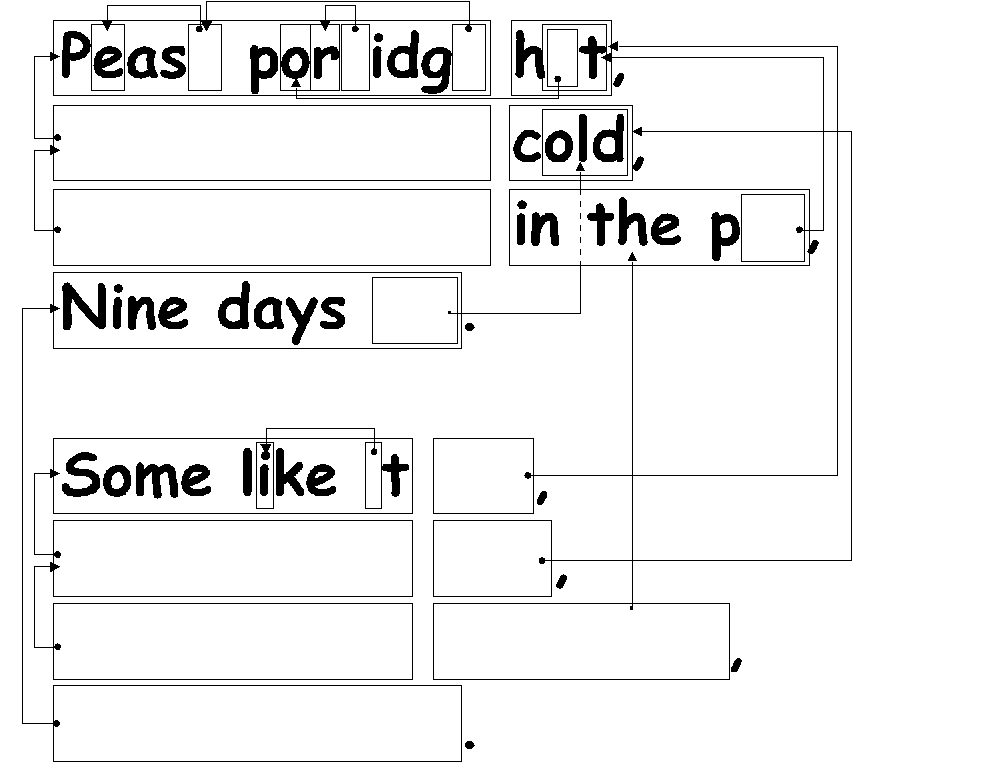
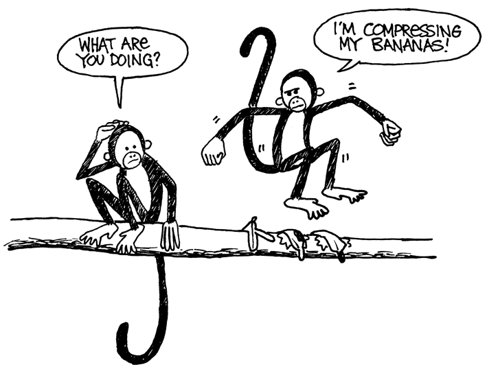

## Activity 3

### You Can Say That Again! —Text Compression
#### Summary
Since computers only have a limited amount of space to hold information, they need to represent information as efficiently as possible. This is called compression. By coding data before it is stored, and decoding it when it is retrieved, the computer can store more data, or send it faster through the Internet.

#### Curriculum Links
- English: Recognising patterns in words and text.
- Technology: Technological knowledge and understanding. How computers work.

#### Skills
- Copying written text

#### Ages
- 9 and up

#### Materials
- OHP transparency made from OHP Master: You can say that again! (page 25)
- Each child will need:
 - Worksheet Activity: You can say that again! (page 26)
 - Worksheet Activity: Extras for experts (page 27)
 - Worksheet Activity: Short and sweet (page 28)
 - Worksheet Activity: Extras for real experts (page 29) 

***

### You can say that again!
#### Introduction 
Computers have to store and transmit a lot of data. So that they don’t have to use up too much storage space, or take too long to send information through a network connection, they compress the text a bit like this. 

#### Demonstration and Discussion 
Show “The Rain” OHP (page 25). Look for the patterns of letters in this poem. Can you find groups of 2 or more letters that are repeated, or even whole words or phrases? (Replace these with boxes as shown in the diagram below.)

***

### OHP Master: You Can Say That Again!

The Rain 
Pitter patter 
Pitter patter 
Listen to the rain 
Pitter patter 
Pitter patter 
On the window pane 

***

### Worksheet Activity: You can say that again!
Many of the words and letters are missing in this poem. Can you fill in the missing letters and words to complete it correctly? You will find these in the box that the arrow is pointing to.

Now choose a simple poem or nursery rhyme and design your own puzzle. Make sure your arrows always point to an earlier part of the text. Your poem should be able to be decoded from left to right and from top to bottom in the same way we read.

Challenge: See how few of the original words you need to keep!

Here are some suggestions: Three Blind Mice, Mary Mary Quite Contrary, Hickory Dickory Dock—or try some Dr Seuss books!

Hint: Try to avoid overcrowding of arrows. Leave a lot of space around letters and words as you write them so that you have room for the boxes within boxes and the arrows pointing to them. 

It is easier to design the puzzle if you write out the poem first and then decide where the boxes need to be. 

***

### Worksheet Activity: Extra for Experts
How would you solve this puzzle?

Sometimes missing text points to part of itself. In this case it can be decoded correctly if the letters are copied from left to right. Then each letter is available to be copied before it is needed. This is useful in computers if there is a long run of a particular character or pattern.

Try drawing some of your own.

On computers the boxes and arrows are represented by numbers. For example, 

Banana

can be written as Ban(2,3). “2” means count back two characters to find the starting point for copying,

Ban---

and “3” means copy three consecutive characters:

Bana--

Banan-

Banana-

As two numbers are used to code these words, usually only groups of two or more letters are worth compressing, otherwise there is no saving of space. In fact the size of the file could go up if two numbers are used to code one letter.

Make up some words of your own written in the way a computer would if they were compressed. Can your friends decode them?

***

### Worksheet Activity: Short and Sweet
How many words do you really need here?

Pretend you are a computer trying to fit as much into your disk as possible. Cross out all the groups of two or more letters that have already occurred. These are no longer needed as they could be replaced by a pointer. Your goal is to get as many letters crossed out as possible.

<pre>
I know an old lady who swallowed a bird
How absurd! She swallowed a bird!
She swallowed the bird to catch the spider
That wriggled and jiggled
        and tickled inside her
She swallowed the spider to catch the fly
I don’t know why she swallowed a fly
Perhaps she’ll die…
</pre>

***

### Worksheet Activity: Extra for Real Experts
Ready for some really tough compression?

The following story was run through a computer program, which found that there are at least 1,633 letters that can be crossed out. How many can you find? Remember, only groups of two or more repeated characters can be eliminated. Good luck!

<pre>
Once upon a time, long, long ago, three little pigs set out to make their fortunes. The first little pig wasn’t very clever, and decided to build his house out of straw, because it was cheap. The second little pig wasn’t very clever either, and decided to build his house out of sticks, for the “natural” look that was so very much in fashion, even in those days. The third little pig was much smarter than his two brothers, and bought a load of bricks in a nearby town, with which to construct a sturdy but comfortable country home.
Not long after his housewarming party, the first little pig was curled up in a chair reading a book, when there came a knock at the door. It was the big bad wolf, naturally.
“Little pig, little pig, let me come in!” cried the wolf.
“Not by the hair on my chinny-chin-chin!” squealed the first little pig.
“Then I’ll huff, and I’ll puff, and I’ll blow your house down!” roared the wolf, and he did huff, and he did puff, and the house soon collapsed. The first little pig ran as fast as he could to the house of sticks, and was soon safe inside. But it wasn’t long before the wolf came calling again.
“Little pig, little pig, let me come in!” cried the wolf.
“Not by the hair on my chinny-chin-chin!” squealed the second little pig.
“Then I’ll huff, and I’ll puff, and I’ll blow your house down!” roared the wolf, and he did huff, and he did puff, and the house was soon so much firewood. The two terrified little pigs ran all the way to their brother’s brick house, but the wolf was hot on their heels, and soon he was on the doorstep.
“Little pig, little pig, let me come in!” cried the wolf.
“Not by the hair on my chinny-chin-chin!” squealed the third little pig.
“Then I’ll huff, and I’ll puff, and I’ll blow your house down!” roared the wolf, and he huffed, and he puffed, and he huffed some more, but of course, the house was built of brick, and the wolf was soon out of breath. Then he had an idea. The chimney! He clambered up a handy oak tree onto the roof, only to find that there was no chimney, because the third little pig, being conscious of the environment, had installed electric heating. In his frustration, the wolf slipped and fell off the roof, breaking his left leg, and severely injuring his pride. As he limped away, the pigs laughed, and remarked how much more sensible it was to live in the city, where the only wolves were in the zoo. And so that is what they did, and of course they all lived happily ever after.
</pre>

***

### What’s it all about?
The storage capacity of computers is growing at an unbelievable rate—in the last 25 years, the amount of storage provided on a typical computer has grown about a millionfold—but we still find more to put into our computers. Computers can store whole books or even libraries, and now music and movies too, if only they have the room. Large files are also a problem on the Internet, because they take a long time to download. We also try to make computers smaller—even a cellphone or wristwatch can be expected to store lots of information!
There is a solution to this problem, however. Instead of buying more storage space, or a faster network connection, we can compress the data so that it takes up less space. This process of compressing and decompressing the data is normally done automatically by the computer. All we might notice is that the disk holds more, or that web pages display faster, but the computer is actually doing more processing.
Many methods of compression have been invented. The method used in this activity, with the principle of pointing to earlier occurrences of chunks of text, is often referred to as ‘Ziv-Lempel coding,’ or ‘LZ coding’, invented by two Israeli professors in the 1970s. It can be used for any language and can easily halve the size of the data being compressed. It is sometimes referred to as ‘zip’ on personal computers, and is also used for ‘GIF’ images, as well as high-speed modems. In the case of modems, it reduces the amount of data that needs to be transmitted over the phone line, so it goes much faster.
Some other methods are based on the idea that letters that are used more often should have shorter codes than the others. Morse code used this idea.

***

### Solutions and hints
You can say that again! (page 26)
Pease porridge hot,
Pease porridge cold,
Pease porridge in the pot,
Nine days old.

Some like it hot,
Some like it cold,
Some like it in the pot,
Nine days old.
