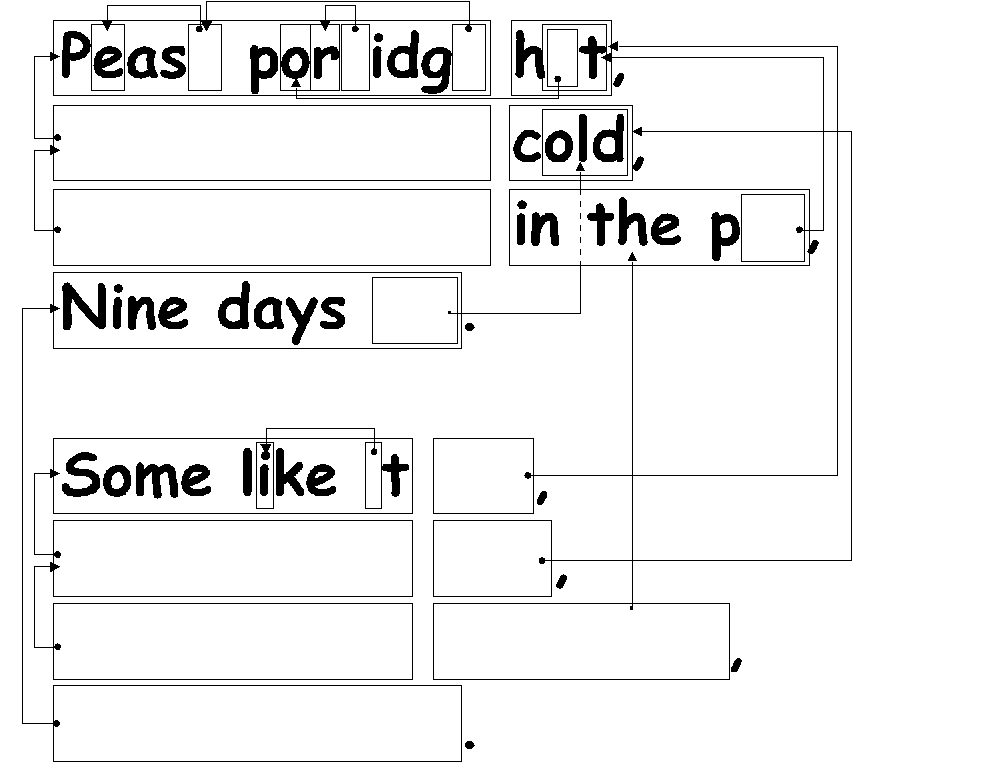
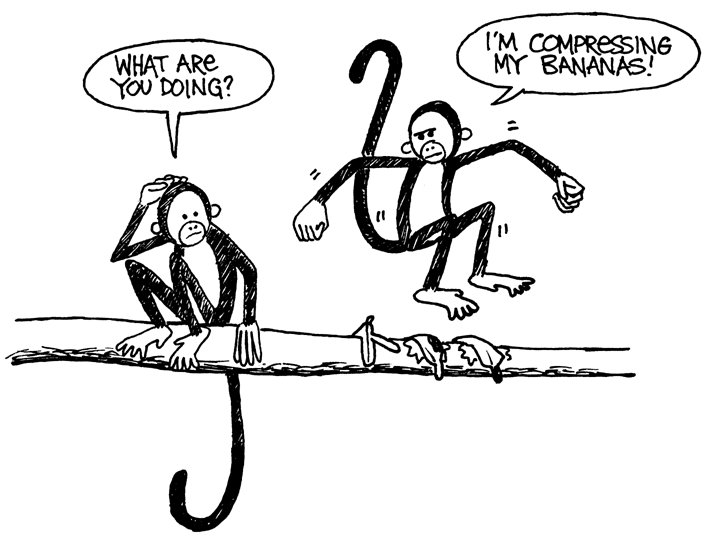

## Activity 3  활동 3

### You Can Say That Again! — Text Compression  한번 더 말할 수 있어! - 문자 압축
#### Summary  요약
Since computers only have a limited amount of space to hold information, they need to represent information as efficiently as possible. This is called compression. By coding data before it is stored, and decoding it when it is retrieved, the computer can store more data, or send it faster through the Internet.
컴퓨터는 정보를 저장할 수 있는 용량이 한정되어 있기 때문에, 정보를 가능한 효율적으로 저장해야 합니다. 이것이 압축(Compression) 입니다. 자료를 저장하기 전에 코딩화(coding)하고, 검색할때는 압축해제(decoding)를 함으로써, 컴퓨터는 자료를 더 저장하거나 인터넷을 통해 빠르게 보낼 수 있습니다.

#### Curriculum Links  관련 교과
- English: Recognising patterns in words and text.  언어: 단어와 글자들 사이의 패턴 찾기
- Technology: Technological knowledge and understanding. How computers work. 기술: 기술적 지식과 이해. 컴퓨터가 작동하는 원리

#### Skills  필요 능력
- Copying written text  글자 따라쓰기

#### Ages  나이
- 9 and up  9세 이상

#### Materials  자료
- OHP transparency made from OHP Master: You can say that again! (page 25)
- Each child will need:
 - Worksheet Activity: You can say that again! (page 26)
 - Worksheet Activity: Extras for experts (page 27)
 - Worksheet Activity: Short and sweet (page 28)
 - Worksheet Activity: Extras for real experts (page 29) 

***

### You can say that again!  한번 더 말할 수 있어!
#### Introduction  설명
Computers have to store and transmit a lot of data. So that they don’t have to use up too much storage space, or take too long to send information through a network connection, they compress the text a bit like this. 
컴퓨터는 많은 자료를 저장하고 전송할 수 있습니다. 컴퓨터는 문자를 압축함으로써 너무 많은 저장 공간을 필요로하지 않고, 인터넷을 통해 정보를 보내는데 너무 많은 시간이 걸리지 않습니다.

#### Demonstration and Discussion  따라하기 및 토론하기
Show “The Rain” OHP (page 25). Look for the patterns of letters in this poem. Can you find groups of 2 or more letters that are repeated, or even whole words or phrases? (Replace these with boxes as shown in the diagram below.)
"The Rain" OHP 를 보세요. 이 시에서 패턴을 찾아보세요. 2번 이상 반복되는 문자, 단어 또는 문구가 있나요? (아래 그림처럼, 반복되는 부분을 네모상자로 바꿔보세요.)

***

### OHP Master: You Can Say That Again!  OHP 마스터 : 한번 더 말할 수 있어!

The Rain 
Pitter patter 
Pitter patter 
Listen to the rain 
Pitter patter 
Pitter patter 
On the window pane 

***

### Worksheet Activity: You can say that again!  활동지 : 한번 더 말할 수 있어!
Many of the words and letters are missing in this poem. Can you fill in the missing letters and words to complete it correctly? You will find these in the box that the arrow is pointing to.
아래의 시에는 여러 단어와 문자가 빠져 있습니다. 빠진 단어와 문자를 정확하게 채워넣을 수 있나요? 화살표가 가리키고 있는 네모상자를 이용하여 찾을 수 있습니다.

Now choose a simple poem or nursery rhyme and design your own puzzle. Make sure your arrows always point to an earlier part of the text. Your poem should be able to be decoded from left to right and from top to bottom in the same way we read.
간단한 시나 동요를 선택하여 새로운 퍼즐 문제를 만들어 봅시다. 퍼즐 문제에서 화살표는 항상 가장 가까이에 있는 반복되는 글자를 가르키고 있어야 합니다. 새로 만든 시는 왼쪽에서 오른쪽으로, 위에서 아래로 해독(decoded)이 가능해야 합니다.

Challenge: See how few of the original words you need to keep!
도전 : 얼마나 적은 단어만 남기고 시를 압축할 수 있을까요?

Here are some suggestions: Three Blind Mice, Mary Mary Quite Contrary, Hickory Dickory Dock—or try some Dr Seuss books!
추가 제안 : Three Blind Mice, Mary Mary Quite Contrary, Hickory Dickory Dock 또는 Dr Seuss books 을 참고하세요!

Hint: Try to avoid overcrowding of arrows. Leave a lot of space around letters and words as you write them so that you have room for the boxes within boxes and the arrows pointing to them.
도움말 : 너무 많은 화살표를 만들지 마세요. 그리고 글자와 단어 주변에 여백을 많이 남겨서, 네모상자와 화살표를 그릴 수 있는 공간을 준비해 두세요.

It is easier to design the puzzle if you write out the poem first and then decide where the boxes need to be.
먼저 시를 작성하고, 나중에 네모상자를 결정한다면 쉽게 퍼즐을 만들 수 있습니다.

***

### Worksheet Activity: Extra for Experts  활동지 : 전문가를 위한 추가 활동
How would you solve this puzzle?  이 퍼즐을 어떻게 풀 수 있을까요?

Sometimes missing text points to part of itself. In this case it can be decoded correctly if the letters are copied from left to right. Then each letter is available to be copied before it is needed. This is useful in computers if there is a long run of a particular character or pattern.
어떤 경우에는 화살표가 자기 자신의 일부를 가리키는 경우가 있습니다. 이런 경우 왼쪽에서 오른쪽으로 하나씩 정확하게 복사한다면 압축을 풀 수 있습니다. 즉, 각각의 글자들이 필요하기 전에 복사되어질 것입니다. 이런 방법은 컴퓨터가 매우 긴 글자나 패턴을 실행하는데 유리하게 사용될 수 있습니다.

Try drawing some of your own.

On computers the boxes and arrows are represented by numbers. For example, 
컴퓨터에서 네모상자와 화살표는 숫자로 표현됩니다. 예를 들면,

Banana

can be written as Ban(2,3). “2” means count back two characters to find the starting point for copying,
는 Ban(2,3)으로 표현될 수 있습니다. "2"는 복사를 시작하는 첫번째 글자의 위치를 나타냅니다.

Ban---

and “3” means copy three consecutive characters:
그리고 "3"은 연이어 글자 3개를 복사하라는 의미입니다.

Bana--

Banan-

Banana-

As two numbers are used to code these words, usually only groups of two or more letters are worth compressing, otherwise there is no saving of space. In fact the size of the file could go up if two numbers are used to code one letter.
이 단어를 압축하기 위해 두개의 숫자를 사용하는데, 일반적으로 두개나 그 이상의 단어들이 압축되었을 경우 유리하며, 그렇지 않으면 저장 공간을 줄이지 못합니다.

Make up some words of your own written in the way a computer would if they were compressed. Can your friends decode them?
컴퓨터가 압축하는 방법과 동일하게 몇개의 단어를 압축해 보세요. 친구들이 압축된 단어를 풀 수 있을까요?

***

### Worksheet Activity: Short and Sweet  활동지 : 짧고 간결하게
How many words do you really need here?
여기에서 정말로 필요한 단어는 몇개인가요?

Pretend you are a computer trying to fit as much into your disk as possible. Cross out all the groups of two or more letters that have already occurred. These are no longer needed as they could be replaced by a pointer. Your goal is to get as many letters crossed out as possible.
여러분이 컴퓨터처럼 자료를 디스크 안에 최대한 넣어야 한다고 가정해 봅시다. 선을 그어 중복되는 두개 이상의 글자들을 모두 지워보세요. 화살표로 바꿀 수 있으므로 더 이상 필요하지 않습니다. 여러분의 목표는 가능한 많은 글자를 지우는 것입니다.

<pre>
I know an old lady who swallowed a bird
How absurd! She swallowed a bird!
She swallowed the bird to catch the spider
That wriggled and jiggled
        and tickled inside her
She swallowed the spider to catch the fly
I don’t know why she swallowed a fly
Perhaps she’ll die…
</pre>

***

### Worksheet Activity: Extra for Real Experts  활동지 : 정말 전문가를 위한 추가 활동
Ready for some really tough compression?
정말로 어려운 압축을 할 준비가 되었나요?

The following story was run through a computer program, which found that there are at least 1,633 letters that can be crossed out. How many can you find? Remember, only groups of two or more repeated characters can be eliminated. Good luck!
###### 다음 이야기는 컴퓨터 프로그램을 이용하면 적어도 1,633개의 중복되어 지울 수 있는 글자를 찾을 수 있습니다. 여러분은 몇 개나 찾았나요? 오직 두 개 이상의 글자 조합만 삭제할 수 있다는 점을 기억하세요. 행운을 빕니다!

<pre>
Once upon a time, long, long ago, three little pigs set out to make their fortunes. The first little pig wasn’t very clever, and decided to build his house out of straw, because it was cheap. The second little pig wasn’t very clever either, and decided to build his house out of sticks, for the “natural” look that was so very much in fashion, even in those days. The third little pig was much smarter than his two brothers, and bought a load of bricks in a nearby town, with which to construct a sturdy but comfortable country home.
Not long after his housewarming party, the first little pig was curled up in a chair reading a book, when there came a knock at the door. It was the big bad wolf, naturally.
“Little pig, little pig, let me come in!” cried the wolf.
“Not by the hair on my chinny-chin-chin!” squealed the first little pig.
“Then I’ll huff, and I’ll puff, and I’ll blow your house down!” roared the wolf, and he did huff, and he did puff, and the house soon collapsed. The first little pig ran as fast as he could to the house of sticks, and was soon safe inside. But it wasn’t long before the wolf came calling again.
“Little pig, little pig, let me come in!” cried the wolf.
“Not by the hair on my chinny-chin-chin!” squealed the second little pig.
“Then I’ll huff, and I’ll puff, and I’ll blow your house down!” roared the wolf, and he did huff, and he did puff, and the house was soon so much firewood. The two terrified little pigs ran all the way to their brother’s brick house, but the wolf was hot on their heels, and soon he was on the doorstep.
“Little pig, little pig, let me come in!” cried the wolf.
“Not by the hair on my chinny-chin-chin!” squealed the third little pig.
“Then I’ll huff, and I’ll puff, and I’ll blow your house down!” roared the wolf, and he huffed, and he puffed, and he huffed some more, but of course, the house was built of brick, and the wolf was soon out of breath. Then he had an idea. The chimney! He clambered up a handy oak tree onto the roof, only to find that there was no chimney, because the third little pig, being conscious of the environment, had installed electric heating. In his frustration, the wolf slipped and fell off the roof, breaking his left leg, and severely injuring his pride. As he limped away, the pigs laughed, and remarked how much more sensible it was to live in the city, where the only wolves were in the zoo. And so that is what they did, and of course they all lived happily ever after.
</pre>

***

### What’s it all about? 어떻게 된 거지?
The storage capacity of computers is growing at an unbelievable rate—in the last 25 years, the amount of storage provided on a typical computer has grown about a millionfold—but we still find more to put into our computers. Computers can store whole books or even libraries, and now music and movies too, if only they have the room. Large files are also a problem on the Internet, because they take a long time to download. We also try to make computers smaller—even a cellphone or wristwatch can be expected to store lots of information!
지난 25년 동안 컴퓨터의 저장 용량은 믿을 수 없을 정도로 빠르게 커지고 있으며, 일반적인 컴퓨터가 제공하는 저장 용량은 백만배 커졌습니다. 그러나 우리는 여전히 컴퓨터에 더 많은 정보를 저장하려고 합니다. 컴퓨터에 저장 공간만 충분하다면 서점, 심지어 도서관에 있는 모든 책을 저장할 수 있으며 음악과 영화도 마찬가지 입니다. 용량이 큰 파일을 인터넷에서 다운로드 받는 경우 시간이 많이 걸리는 문제가 생깁니다. 우리는 또한 핸드폰이나 손목시계 만큼 작은 컴퓨터에 더 많은 정보를 저장하고 싶어 합니다.

There is a solution to this problem, however. Instead of buying more storage space, or a faster network connection, we can compress the data so that it takes up less space. This process of compressing and decompressing the data is normally done automatically by the computer. All we might notice is that the disk holds more, or that web pages display faster, but the computer is actually doing more processing.
그러나 이 문제를 해결할 방법이 있습니다. 더 많은 저장 공간을 구입하거나 더 빠른 네트워크 연결을 구축하는 것이 아니라, 데이터를 압축함으로써 더 적은 저장 공간을 차지하게 하는 것입니다. 자료의 압축과 압축 해제는 컴퓨터가 자동으로 해줍니다. 우리가 주목해야 할 것은 디스크에 더 많이 저장하거나 웹 페이지가 더 빠르게 표시되는지가 아니라 컴퓨터 실제로 더 많은 연산을 수행한다는 사실입니다.

Many methods of compression have been invented. The method used in this activity, with the principle of pointing to earlier occurrences of chunks of text, is often referred to as ‘Ziv-Lempel coding,’ or ‘LZ coding’, invented by two Israeli professors in the 1970s. It can be used for any language and can easily halve the size of the data being compressed. It is sometimes referred to as ‘zip’ on personal computers, and is also used for ‘GIF’ images, as well as high-speed modems. In the case of modems, it reduces the amount of data that needs to be transmitted over the phone line, so it goes much faster.
다양한 압축 기법이 개발되었습니다. 이번 활동에서 사용한 자주 등장하는 글자의 첫번째를 가리키는 방식은, 1970년대 2명의 이스라엘 교수에 의해 개발된 '지브-럼펠 코딩(Ziv-Lempel coding)' 또는 'LZ coding' 이라고 부르는 압축 기법 입니다. 이 압축 기법은 어떤 언어에서도 사용할 수 있고, 자료의 용량을 반으로 압축할 수 있습니다. 이 방법은 개인 컴퓨터에서 사용하는 압축 포멧인 'zip' 과 관련이 있으며, 'GIF' 이미지에도 사용되고, 초고속 모뎀과도 관련되어 있습니다. 모뎀의 경우, 이 기법은 통신선으로 전송되는 자료의 용량을 줄여서 보다 더 빠르게 전송되도록 합니다.

Some other methods are based on the idea that letters that are used more often should have shorter codes than the others. Morse code used this idea.
대부분의 다른 압축 기법은 이 압축 기법의 원리인 많이 사용되는 글자를 보다 더 짧게 만드는 원리를 기반으로 합니다. 모스 부호 역시 이 원리를 사용합니다.

***

### Solutions and hints  정답과 도움말
You can say that again! (page 26)
Pease porridge hot,
Pease porridge cold,
Pease porridge in the pot,
Nine days old.

Some like it hot,
Some like it cold,
Some like it in the pot,
Nine days old.
